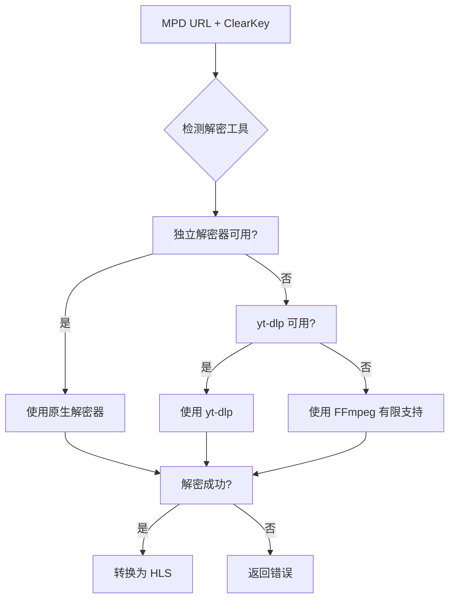

# ClearKey MPEG-DASH 解密功能

## 概述

由于 FFmpeg 本身不具备完整的 ClearKey 解密能力，特别是对于 MPEG-DASH 流，本项目提供了多种外部解密工具和脚本来处理 ClearKey 加密的 DASH 内容。

## 解密方法

### 1. 独立 ClearKey 解密器 (`clearkey_decrypt.py`)

这是一个完全独立的 Python 脚本，实现了完整的 ClearKey 解密流程：

#### 功能特性
- **原生 DASH 解析**: 直接解析 MPD 清单文件，提取媒体分段信息
- **ClearKey 解密**: 使用 AES 算法进行标准 ClearKey 解密
- **多格式支持**: 支持各种 DASH 流格式和分段类型
- **独立运行**: 不依赖 FFmpeg 的有限解密功能

#### 使用方法

```bash
# 基本用法
python3 clearkey_decrypt.py "https://example.com/stream.mpd" \
  --license-key "key_id:key_value" \
  --output-dir "./decrypted_output"

# 指定解密方法
python3 clearkey_decrypt.py "https://example.com/stream.mpd" \
  --license-key "1234567890abcdef1234567890abcdef:fedcba0987654321fedcba0987654321" \
  --method native \
  --verbose

# 使用 yt-dlp 方法
python3 clearkey_decrypt.py "https://example.com/stream.mpd" \
  --license-key "key_id:key_value" \
  --method yt-dlp
```

#### 参数说明
- `mpd_url`: MPD 流地址
- `--license-key`: ClearKey 许可证，格式为 `key_id:key` (十六进制)
- `--output-dir`: 输出目录 (默认: `./decrypted_output`)
- `--method`: 解密方法
  - `native`: 使用原生 Python 解密器
  - `yt-dlp`: 使用 yt-dlp 工具
  - `auto`: 自动选择最佳方法 (默认)
- `--verbose`: 详细输出

### 2. yt-dlp 解密器

利用 yt-dlp 工具的外部下载器功能，通过 FFmpeg 进行解密。

#### 特点
- 依赖 yt-dlp 和 FFmpeg
- 适合处理常见的 DASH 流格式
- 自动处理格式转换

### 3. 增强的集成解密

主应用程序 (`app.py`) 现在包含增强的解密功能：

#### 工作流程
1. **检测加密**: 当检测到 ClearKey 许可证时，自动启用解密
2. **多级回退**: 
   - 优先使用独立解密器
   - 备用 yt-dlp 方法
   - 最后回退到 FFmpeg 的有限支持
3. **无缝集成**: 解密过程对用户透明，自动处理临时文件

## ClearKey 格式

### 许可证格式
```
key_id:key_value
```

- `key_id`: 128 位密钥 ID (32 个十六进制字符)
- `key_value`: 128 位加密密钥 (32 个十六进制字符)

### 示例
```
1234567890abcdef1234567890abcdef:fedcba0987654321fedcba0987654321
```

### Kodi 格式支持
```
#KODIPROP:inputstream.adaptive.manifest_type=mpd
#KODIPROP:inputstream.adaptive.license_type=clearkey
#KODIPROP:inputstream.adaptive.license_key=key_id:key_value
https://example.com/stream.mpd
```

## 架构说明

### 核心组件

1. **DashDecryptor 类** (`app.py`)
   - 检测可用的解密工具
   - 统一的解密接口
   - 智能方法选择

2. **ClearKeyDecryptor 类** (`clearkey_decrypt.py`)
   - 原生 DASH 解析和解密
   - AES 解密实现
   - 异步处理支持

3. **YtDlpDecryptor 类** (`clearkey_decrypt.py`)
   - yt-dlp 集成
   - 外部工具管理

### 解密流程



## 性能优化

### 1. 异步处理
- 所有网络请求使用 `aiohttp`
- 并行下载和解密分段
- 非阻塞的 FFmpeg 进程管理

### 2. 内存管理
- 流式处理大文件
- 临时文件自动清理
- 进程资源管理

### 3. 缓存机制
- 工具可用性检测缓存
- 解密结果复用

## 错误处理

### 常见错误类型
1. **网络错误**: MPD 文件或分段下载失败
2. **格式错误**: 无效的 ClearKey 格式
3. **解密错误**: 密钥错误或分段损坏
4. **工具缺失**: 所需的外部工具不可用

### 错误恢复
- 多级回退机制
- 详细的错误日志
- 自动清理机制

## 部署注意事项

### 依赖要求
```bash
# Python 包
pip install aiohttp pycryptodome

# 系统工具 (可选但推荐)
sudo apt-get install yt-dlp ffmpeg
```

### Docker 集成
现有的 Dockerfile 已包含所有必要依赖：
```dockerfile
RUN apt-get update && apt-get install -y ffmpeg
RUN pip install pycryptodome yt-dlp
```

### 安全考虑
- ClearKey 密钥在日志中被隐藏
- 临时文件安全清理
- 进程隔离

## 测试

### 运行测试
```bash
# 基本功能测试
python test_clearkey_decryption.py

# 原有功能回归测试
python tests/test_app.py

# 独立工具测试
python3 clearkey_decrypt.py --help
```

### 测试覆盖
- ClearKey 解析和验证
- 多种解密方法
- 错误处理和恢复
- 集成测试

## 故障排除

### 1. 解密失败
```bash
# 检查许可证格式
echo "key_id:key_value" | python3 -c "
import sys
line = sys.stdin.read().strip()
if ':' in line:
    kid, key = line.split(':', 1)
    print(f'Key ID: {len(kid)} chars')
    print(f'Key: {len(key)} chars')
else:
    print('Invalid format')
"

# 详细调试
python3 clearkey_decrypt.py URL --license-key KEY --verbose
```

### 2. 工具检测问题
```bash
# 检查工具可用性
yt-dlp --version
ffmpeg -version

# 检查 Python 包
python3 -c "import Crypto.Cipher.AES; print('pycryptodome OK')"
```

### 3. 网络问题
- 检查防火墙设置
- 验证 MPD URL 可访问性
- 检查 SSL 证书问题

## 扩展性

### 添加新的解密方法
1. 在 `DashDecryptor` 类中添加新方法
2. 更新 `decrypt_dash_stream` 的路由逻辑
3. 添加相应的测试

### 支持其他 DRM
架构支持扩展到其他 DRM 系统：
- Widevine
- PlayReady
- 自定义 DRM

## 许可证

本解密功能遵循项目许可证，仅用于：
- 合法拥有的内容
- 教育和研究目的
- 兼容性测试

⚠️ **重要**: 请确保您有权解密和使用相关内容。